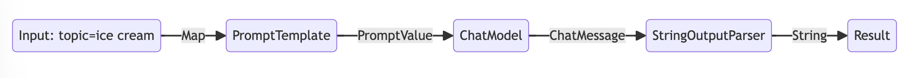
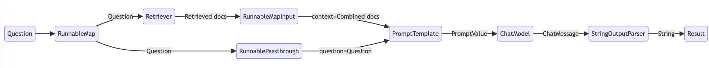

# Get started

LCEL makes it easy to build complex chains from basic components, and supports out of the box functionality such as streaming, parallelism, and logging.

# Basic example: prompt + model + output parser

The most basic and common use case is chaining a prompt template and a model together. To see how this works, let’s create a chain that takes a topic and generates a joke:

```dart
final openaiApiKey = Platform.environment['OPENAI_API_KEY'];

final promptTemplate = ChatPromptTemplate.fromTemplate(
  'Tell me a joke about {topic}',
);
final model = ChatOpenAI(apiKey: openaiApiKey);
const outputParser = StringOutputParser<ChatResult>();

final chain = promptTemplate.pipe(model).pipe(outputParser);

final res = await chain.invoke({'topic': 'ice cream'});
print(res);
// Why did the ice cream truck break down?
// Because it had too many "scoops"!
```

Notice this line of this code, where we piece together then different components into a single chain using LCEL:

```dart
final chain = promptTemplate.pipe(model).pipe(outputParser);
```

The `.pipe()` method (or `|` operator) is similar to a unix pipe operator, which chains together the different components feeds the output from one component as input into the next component.

In this chain the user input is passed to the prompt template, then the prompt template output is passed to the model, then the model output is passed to the output parser. Let’s take a look at each component individually to really understand what’s going on.

## 1. Prompt

`promptTemplate` is a `BasePromptTemplate`, which means it takes in a map of template variables and produces a `PromptValue`. A `PromptValue` is a wrapper around a completed prompt that can be passed to either an `LLM` (which takes a string as input) or `ChatModel` (which takes a sequence of messages as input). It can work with either language model type because it defines logic both for producing `ChatMessage` and for producing a string.

```dart
final promptValue = await promptTemplate.invoke({'topic': 'ice cream'});

final messages = promptValue.toChatMessages();
print(messages);
// [HumanChatMessage{
//   content: ChatMessageContentText{
//     text: Tell me a joke about ice cream,
//   },
// }]

final string = promptValue.toString();
print(string);
// Human: Tell me a joke about ice cream
```

## 2. Model

The `PromptValue` is then passed to `model`. In this case our `model` is a `ChatModel`, meaning it will output a `ChatMessage`.

```dart
final chatOutput = await model.invoke(promptValue);
print(chatOutput.output);
// AIChatMessage{
//   content: Why did the ice cream truck break down? 
//   Because it couldn't make it over the rocky road!,
// }
```

If our model was an `LLM`, it would output a `String`.

```dart
final llm = OpenAI(apiKey: openaiApiKey);
final llmOutput = await llm.invoke(promptValue);
print(llmOutput.output);
// Why did the ice cream go to therapy?
// Because it had a rocky road!
```

## 3. Output parser

And lastly we pass our `model` output to the `outputParser`, which is a `BaseOutputParser` meaning it takes either a `String` or a `ChatMessage` as input. The `StringOutputParser` specifically simple converts any input into a `String`.

```dart
final parsed = await outputParser.invoke(chatOutput);
print(parsed);
// Why did the ice cream go to therapy?
// Because it had a rocky road!
```

## 4. Entire Pipeline

To follow the steps along:

1. We pass in user input on the desired topic as `{'topic': 'ice cream'}`
2. The `promptTemplate` component takes the user input, which is then used to construct a `PromptValue` after using the `topic` to construct the prompt.
3. The `model` component takes the generated prompt, and passes into the OpenAI chat model for evaluation. The generated output from the model is a `ChatMessage` object (specifically an `AIChatMessage`).
4. Finally, the `outputParser` component takes in a `ChatMessage`, and transforms this into a `String`, which is returned from the invoke method.



Note that if you’re curious about the output of any components, you can always test out a smaller version of the chain such as `promptTemplate` or `promptTemplate.pipe(model)` to see the intermediate results.

```dart
final input = {'topic': 'ice cream'};

final res1 = await promptTemplate.invoke(input);
print(res1.toChatMessages());
// [HumanChatMessage{
//   content: ChatMessageContentText{
//     text: Tell me a joke about ice cream,
//   },
// }]

final res2 = await promptTemplate.pipe(model).invoke(input);
print(res2);
// ChatResult{
//   id: chatcmpl-9J37Tnjm1dGUXqXBF98k7jfexATZW,
//   output: AIChatMessage{
//     content: Why did the ice cream cone go to therapy? Because it had too many sprinkles of emotional issues!,
//   },
//   finishReason: FinishReason.stop,
//   metadata: {
//     model: gpt-3.5-turbo-0125,
//     created: 1714327251,
//     system_fingerprint: fp_3b956da36b
//   },
//   usage: LanguageModelUsage{
//     promptTokens: 14,
//     promptBillableCharacters: null,
//     responseTokens: 21,
//     responseBillableCharacters: null,
//     totalTokens: 35
//     },
//   streaming: false
// }
```

## RAG Search Example

For our next example, we want to run a retrieval-augmented generation chain to add some context when responding to questions.

```dart
// 1. Create a vector store and add documents to it
final vectorStore = MemoryVectorStore(
  embeddings: OpenAIEmbeddings(apiKey: openaiApiKey),
);
await vectorStore.addDocuments(
  documents: [
    Document(pageContent: 'LangChain was created by Harrison'),
    Document(pageContent: 'David ported LangChain to Dart in LangChain.dart'),
  ],
);

// 2. Define the retrieval chain
final retriever = vectorStore.asRetriever();
final setupAndRetrieval = Runnable.fromMap<String>({
  'context': retriever.pipe(
    Runnable.mapInput((docs) => docs.map((d) => d.pageContent).join('\n')),
  ),
  'question': Runnable.passthrough(),
});

// 3. Construct a RAG prompt template
final promptTemplate = ChatPromptTemplate.fromTemplates([
  (ChatMessageType.system, 'Answer the question based on only the following context:\n{context}'),
  (ChatMessageType.human, '{question}'),
]);

// 4. Define the final chain
final model = ChatOpenAI(apiKey: openaiApiKey);
const outputParser = StringOutputParser<ChatResult>();
final chain = setupAndRetrieval
    .pipe(promptTemplate)
    .pipe(model)
    .pipe(outputParser);

// 5. Run the pipeline
final res = await chain.invoke('Who created LangChain.dart?');
print(res);
// David created LangChain.dart
```

In this case, the composed chain is:

```dart
final chain = setupAndRetrieval
    .pipe(promptTemplate)
    .pipe(model)
    .pipe(outputParser);
```

To explain this, we first can see that the prompt template above takes in `context` and `question` as values to be substituted in the prompt. Before building the prompt template, we want to retrieve relevant documents to the search and include them as part of the context.

As a preliminary step, we’ve set up the retriever using an in memory store, which can retrieve documents based on a query. This is a runnable component as well that can be chained together with other components, but you can also try to run it separately:

```dart
final res1 = await retriever.invoke('Who created LangChain.dart?');
print(res1);
// [Document{pageContent: David ported LangChain to Dart in LangChain.dart}, 
// Document{pageContent: LangChain was created by Harrison, metadata: {}}]
```

We then use the `RunnableMap` to prepare the expected inputs into the prompt by using a string containing the combined retrieved documents as well as the original user question, using the `retriever` for document search, a `RunnableMapInput` to combine the documents and `RunnablePassthrough` to pass the user's question:

```dart
final setupAndRetrieval = Runnable.fromMap<String>({
  'context': retriever.pipe(
    Runnable.mapInput((docs) => docs.map((d) => d.pageContent).join('\n')),
  ),
  'question': Runnable.passthrough(),
});
```

To review, the complete chain is:

```dart
final chain = setupAndRetrieval
    .pipe(promptTemplate)
    .pipe(model)
    .pipe(outputParser);
```

With the flow being:
1. The first steps create a `RunnableMap` object with two entries. The first entry, `context` will include the combined document results fetched by the retriever. The second entry, `question` will contain the user’s original question. To pass on the `question`, we use `RunnablePassthrough` to copy this entry.
2. Feed the map from the step above to the `promptTemplate` component. It then takes the user input which is `question` as well as the retrieved documents which is `context` to construct a prompt and output a `PromptValue`.
3. The `model` component takes the generated prompt, and passes into the OpenAI LLM model for evaluation. The generated `output` from the model is a `ChatResult` object.
4. Finally, the `outputParser` component takes in the `ChatResult`, and transforms this into a Dart String, which is returned from the invoke method.


