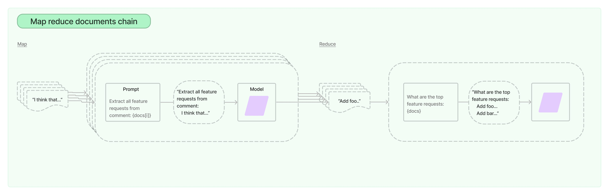

# Stuff

The `MapReduceDocumentsChain` first applies an LLM chain to each document
individually (the Map step), treating the chain output as a new document. It
then passes all the new documents to a separate combine documents chain to get a
single output (the Reduce step). It can optionally first compress, or collapse,
the mapped documents to make sure that they fit in the combine documents chain (
which will often pass them to an LLM). This compression step is performed
recursively if necessary.


*Image source: [LangChain docs](https://python.langchain.com/docs/modules/chains/document/map_reduce)*

```dart
final mapPrompt = PromptTemplate.fromTemplate(
  'Summarize this content: {context}',
);
final mapLlmChain = LLMChain(prompt: mapPrompt, llm: llm);
final reducePrompt = PromptTemplate.fromTemplate(
  'Combine these summaries: {context}',
);
final reduceLlmChain = LLMChain(prompt: reducePrompt, llm: llm);
final reduceDocsChain = StuffDocumentsChain(llmChain: reduceLlmChain);
final reduceChain = MapReduceDocumentsChain(
  mapLlmChain: mapLlmChain,
  reduceDocumentsChain: reduceDocsChain,
);
const docs = [
  Document(pageContent: 'Hello 1!'),
  Document(pageContent: 'Hello 2!'),
  Document(pageContent: 'Hello 3!'),
];
final res = await reduceChain.run(docs);
```
