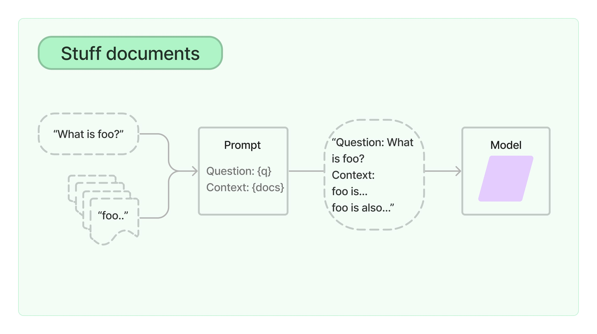

# Stuff

The `StuffDocumentsChain` ("stuff" as in "to stuff" or "to fill") is the most
straightforward of the document chains. It takes a list of documents, inserts
them all into a prompt and passes that prompt to an LLM.

This chain is well-suited for applications where documents are small and only a
few are passed in for most calls.


*Image source: [LangChain docs](https://python.langchain.com/docs/modules/chains/document/stuff)*

```dart
final prompt = PromptTemplate.fromTemplate(
  'Print {foo}. Context: {context}',
);
final llm = OpenAI(apiKey: openaiApiKey);
final llmChain = LLMChain(prompt: prompt, llm: llm);
final stuffChain = StuffDocumentsChain(llmChain: llmChain)
const foo = 'Hello world!';
const docs = [
  Document(pageContent: 'Hello 1!'),
  Document(pageContent: 'Hello 2!'),
];
final res = await stuffChain.call({
  'foo': foo,
  'input_documents': docs,
});
```
