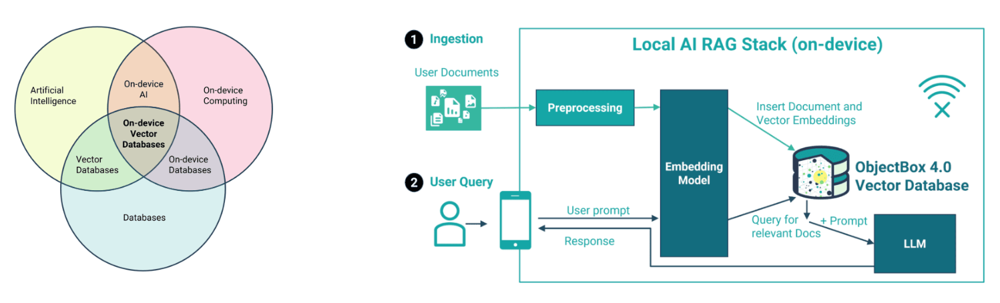

# ObjectBox

Vector store for the [ObjectBox](https://objectbox.io/) on-device database.

ObjectBox features:
- Embedded Database that runs inside your application without latency
- Vector search based is state-of-the-art HNSW algorithm that scales very well with growing data volume
- HNSW is tightly integrated within ObjectBox's internal database. Vector Search doesn’t just run “on top of database persistence”
- With this deep integration ObjectBox does not need to keep all vectors in memory
- Multi-layered caching: if a vector is not in-memory, ObjectBox fetches it from disk
- Not just a vector database: you can store any data in ObjectBox, not just vectors. You won’t need a second database
- Low minimum hardware requirements: e.g. an old Raspberry Pi comfortably runs ObjectBox smoothly
- Low memory footprint: ObjectBox itself just takes a few MB of memory. The entire binary is only about 3 MB (compressed around 1 MB)
- Scales with hardware: efficient resource usage is also an advantage when running on more capable devices like the latest phones, desktops and servers

Official ObjectBox resources:
- [ObjectBox Vector Search docs](https://docs.objectbox.io/ann-vector-search)
- [The first On-Device Vector Database: ObjectBox 4.0](https://objectbox.io/the-first-on-device-vector-database-objectbox-4-0)
- [On-device Vector Database for Dart/Flutter](https://objectbox.io/on-device-vector-database-for-dart-flutter)

## Setup

LangChain.dart offers two classes for working with ObjectBox:
- `ObjectBoxVectorStore`: This vector stores creates a `Store` with an `ObjectBoxDocument` entity that persists LangChain `Document`s along with their embeddings.
- `BaseObjectBoxVectorStore`: If you need more control over the entity (e.g. if you need to persist custom fields), you can use this class instead.

###  1. Add ObjectBox to your project

See the [ObjectBox documentation](https://docs.objectbox.io/getting-started) to learn how to add ObjectBox to your project.

Note that the integration differs depending on whether you are building a Flutter application or a pure Dart application.

### 2. Add the LangChain.dart Community package

Add the `langchain_community` package to your `pubspec.yaml` file.

```yaml
dependencies:
  langchain: {version}
  langchain_community: {version}
```

### 3. Instantiate the ObjectBox vector store

```dart
final embeddings = OllamaEmbeddings(model: 'jina/jina-embeddings-v2-small-en');
final vectorStore = ObjectBoxVectorStore(
  embeddings: embeddings,
  dimensions: 512,
);
```

The dimensions parameter specifies the number of dimensions of the embeddings. It will depend on the embeddings model you are using. In this example, we are using the [jina/jina-embeddings-v2-small-en](https://ollama.com/jina/jina-embeddings-v2-small-en) model, which has 512 dimensions.

The `ObjectBoxVectorStore` constructor allows you to customize the ObjectBox store that is created under the hood. For example, you can change the directory where the database is stored:

```dart
final vectorStore = ObjectBoxVectorStore(
  embeddings: embeddings,
  dimensions: 512,
  directory: 'path/to/db',
);
```

## Usage

### Storing vectors

```dart
final res = await vectorStore.addDocuments(
  documents: [
    Document(
      pageContent: 'The cat sat on the mat',
      metadata: {'cat': 'animal'},
    ),
    Document(
      pageContent: 'The dog chased the ball.',
      metadata: {'cat': 'animal'},
    ),
  ],
);
```

### Querying vectors

```dart
final res = await vectorStore.similaritySearch(
  query: 'Where is the cat?',
  config: const ObjectBoxSimilaritySearch(k: 1),
);
```

You can change the minimum similarity score threshold by setting the `scoreThreshold` parameter in the `ObjectBoxSimilaritySearch` config object.

#### Filtering

You can use the `ObjectBoxSimilaritySearch` class to pass ObjectBox-specific filtering options.

`ObjectBoxVectorStore` supports filtering queries by id, content or metadata using ObjectBox's `Condition`. You can define the filter condition in the `ObjectBoxSimilaritySearch.filterCondition` parameter. Use the `ObjectBoxDocumentProps` class to reference the entity fields to use in the query.

For example:
```dart
final res = await vectorStore.similaritySearch(
  query: 'What should I feed my cat?',
  config: ObjectBoxSimilaritySearch(
    k: 5,
    scoreThreshold: 0.8,
    filterCondition: ObjectBoxDocumentProps.id.equals('my-id')
        .or(ObjectBoxDocumentProps.metadata.contains('some-text')),
  ),
);
```

### Deleting vectors

To delete documents, you can use the `delete` method passing the ids of the documents you want to delete.

```dart
await vectorStore.delete(ids: ['9999']);
```

## Example: Building a Fully Local RAG App with ObjectBox and Ollama

This example demonstrates how to build a fully local RAG (Retrieval-Augmented Generation) app using ObjectBox and Ollama. The app retrieves blog posts, splits them into chunks, and stores them in an ObjectBox vector store. It then uses the stored information to generate responses to user questions.



#### Prerequisites

Before running the example, make sure you have the following:

- Ollama installed (see the [Ollama documentation](https://ollama.com/) for installation instructions).
- [jina/jina-embeddings-v2-small-en](https://ollama.com/jina/jina-embeddings-v2-small-en) and [llama3:8b](https://ollama.com/library/llama3:8b) models downloaded.

#### Steps

**Step 1: Retrieving and Storing Documents**

1. Retrieve several posts from the ObjectBox blog using a `WebBaseLoader` document loader.
2. Split the retrieved posts into chunks using a `RecursiveCharacterTextSplitter`.
3. Create embeddings from the document chunks using the `jina/jina-embeddings-v2-small-en` embeddings model via `OllamaEmbeddings`.
4. Add the document chunks and their corresponding embeddings to the `ObjectBoxVectorStore`.

> Note: this step only needs to be executed once (unless the documents change). The stored documents can be used for multiple queries.

**Step 2: Constructing the RAG Pipeline**

1. Set up a retrieval pipeline that takes a user question as input and retrieves the most relevant documents from the ObjectBox vector store.
2. Format the retrieved documents into a single string containing the source, title, and content of each document.
3. Pass the formatted string to the Llama 3 model to generate a response to the user question.

```dart
// 1. Instantiate vector store
final vectorStore = ObjectBoxVectorStore(
  embeddings: OllamaEmbeddings(model: 'jina/jina-embeddings-v2-small-en'),
  dimensions: 512,
);

// 2. Load documents
const loader = WebBaseLoader([
  'https://objectbox.io/on-device-vector-databases-and-edge-ai/',
  'https://objectbox.io/the-first-on-device-vector-database-objectbox-4-0/',
  'https://objectbox.io/on-device-vector-database-for-dart-flutter/',
  'https://objectbox.io/evolution-of-search-traditional-vs-vector-search//',
]);
final List<Document> docs = await loader.load();

// 3. Split docs into chunks
const splitter = RecursiveCharacterTextSplitter(
  chunkSize: 500,
  chunkOverlap: 0,
);
final List<Document> chunkedDocs = await splitter.invoke(docs);

// 4. Add documents to vector store
await vectorStore.addDocuments(documents: chunkedDocs);

// 5. Construct a RAG prompt template
final promptTemplate = ChatPromptTemplate.fromTemplates([
  (ChatMessageType.system,
    '''
You are an assistant for question-answering tasks.

Use the following pieces of retrieved context to answer the user question.

Context:
{context}

If you don't know the answer, just say that you don't know. 
Use three sentences maximum and keep the answer concise.
Cite the source you used to answer the question.

Example:
"""
One sentence [1]. Another sentence [2]. 

Sources:
[1] https://example.com/1
[2] https://example.com/2
"""
'''
  ),
  (ChatMessageType.human, '{question}'),
]);

// 6. Define the model to use and the vector store retriever
final chatModel = ChatOllama(
  defaultOptions: ChatOllamaOptions(model: 'llama3.1'),
);
final retriever = vectorStore.asRetriever();

// 7. Create a Runnable that combines the retrieved documents into a single formatted string
final docCombiner = Runnable.mapInput<List<Document>, String>((docs) {
  return docs.map((d) => '''
Source: ${d.metadata['source']}
Title: ${d.metadata['title']}
Content: ${d.pageContent}
---
''').join('\n');
});

// 8. Define the RAG pipeline
final chain = Runnable.fromMap<String>({
  'context': retriever.pipe(docCombiner),
  'question': Runnable.passthrough(),
}).pipe(promptTemplate).pipe(chatModel).pipe(StringOutputParser());

// 9. Run the pipeline
final stream = chain.stream(
  'Which algorithm does ObjectBox Vector Search use? Can I use it in Flutter apps?',
);
await stream.forEach(stdout.write);
// According to the sources provided, ObjectBox Vector Search uses the HNSW
// (Hierarchical Navigable Small World) algorithm [1].
//
// And yes, you can use it in Flutter apps. The article specifically mentions
// that ObjectBox 4.0 introduces an on-device vector database for the
// Dart/Flutter platform [2].
//
// Sources:
// [1] https://objectbox.io/first-on-device-vector-database-objectbox-4-0/
// [2] https://objectbox.io/on-device-vector-database-for-dart-flutter/
```

## Example: Wikivoyage EU

Check out the [Wikivoyage EU example](https://github.com/davidmigloz/langchain_dart/tree/main/examples/wikivoyage_eu), to see how to build a fully local chatbot that uses RAG to plan vacation plans in Europe.

## Advance

### BaseObjectBoxVectorStore

If you need more control over the entity (e.g. if you need to persist custom fields), you can use the `BaseObjectBoxVectorStore` class instead of `ObjectBoxVectorStore`.

`BaseObjectBoxVectorStore` requires the following parameters:
- `embeddings`: The embeddings model to use.
- `box`: The ObjectBox `Box` instance to use.
- `createEntity`: A function that creates an entity from the given data.
- `createDocument`: A function that creates a LangChain's `Document` from the given entity.
- `getIdProperty`: A function that returns the ID property of the entity.
- `getEmbeddingProperty`: A function that returns the embedding property of the entity.

You can check how `ObjectBoxVectorStore` is implemented to see how to use `BaseObjectBoxVectorStore`.
