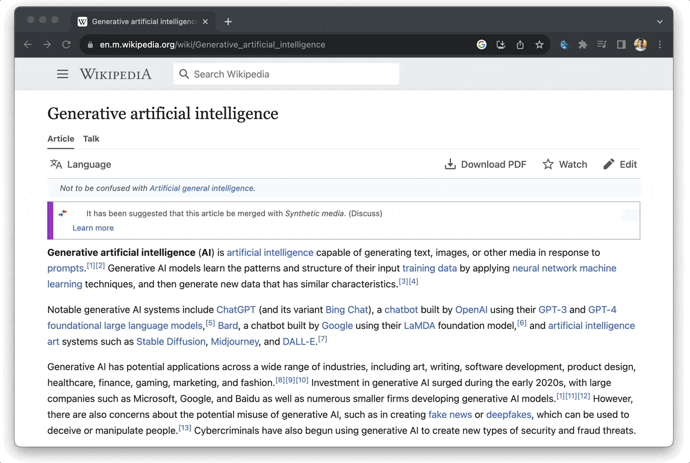

# Browser summarizer

This sample app demonstrates how to build a Flutter-based Chrome extension that 
summarizes the content of a webpage using OpenAI's GPT-4o mini model.



## Usage

**Building the project:**

```bash
flutter build web --csp --no-web-resources-cdn
```

**Installing the extension:**

1. Open the Extension Management page by navigating to `chrome://extensions`.
2. Enable "Developer Mode" by clicking the toggle located in the upper-right 
   corner.
3. Click "Load unpacked" and select the generated build/web folder from our 
   project.

To use the extension you need an OpenAI key, you can create one 
[here](https://platform.openai.com/account/api-keys).
