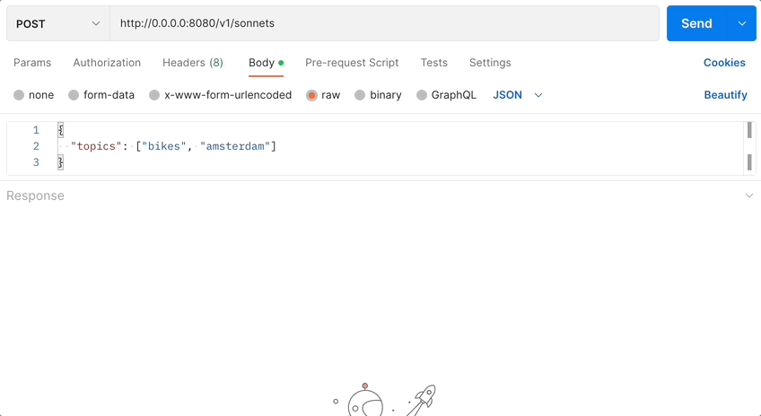

# Hello world backend

This sample demonstrates how to build a simple backend service that interacts with an LLM using
LangChain.dart.

It exposes a REST API that given a list of topics, generates a sonnet about them.

The HTTP server is implemented using [package:shelf](https://pub.dev/packages/shelf).

You can find all the details in the [LangChain.dart 101: what can you build with it?](https://blog.langchaindart.com/langchain-dart-101-what-can-you-build-with-it-%EF%B8%8F-99a92ccaec5f)
blog post.



## Usage

- Listens on "any IP" (0.0.0.0) instead of loop-back (localhost, 127.0.0.1) to
  allow remote connections.
- Defaults to listening on port `8080`, but this can be configured by setting
  the `PORT` environment variable. (This is also the convention used by
  [Cloud Run](https://cloud.google.com/run).)
- Includes `Dockerfile` for easy containerization

To run this server locally, run as follows:

```bash
$ dart run bin/server.dart
```

Then send a request:

```bash
$ curl -X POST \
    -H "Content-Type: application/json" \
    -d '{
      "topics": ["bikes", "amsterdam"]
    }' \
    http://0.0.0.0:8080/v1/sonnets
```

To deploy on [Cloud Run](https://cloud.google.com/run), click here

[](https://deploy.cloud.run/?git_repo=https://github.com/davidmigloz/langchain_dart.git&dir=examples/hello_world_backend)

or follow
[these instructions](https://cloud.google.com/run/docs/quickstarts/build-and-deploy/other).
