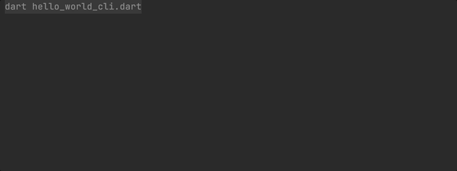

# Hello world CLI

This sample app demonstrates how to call an LLM from a CLI application using LangChain.dart.

You can find all the details in the [LangChain.dart 101: what can you build with it?](https://blog.langchaindart.com/langchain-dart-101-what-can-you-build-with-it-%EF%B8%8F-99a92ccaec5f) 
blog post.

## Usage

```bash
dart run bin/hello_world_cli.dart
```


