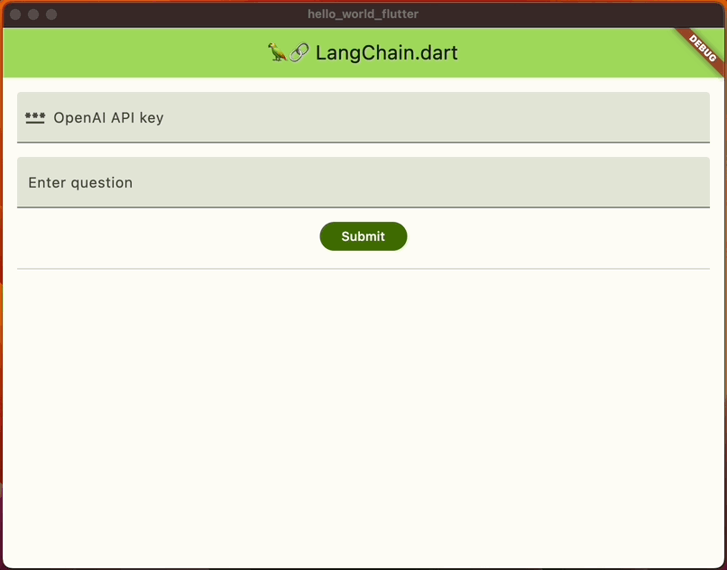

# Hello World Flutter

This sample application demonstrates how to call various remote and local LLMs from a Flutter application using LangChain.dart.



## Usage

```bash
flutter run
```

- To use the remote providers you need to provide your API key. 
- To use local models you need to have the [Ollama](https://ollama.ai/) app running and the model downloaded. 
