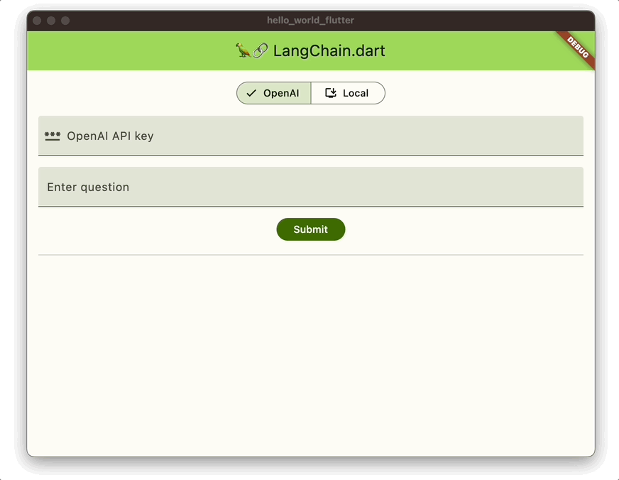
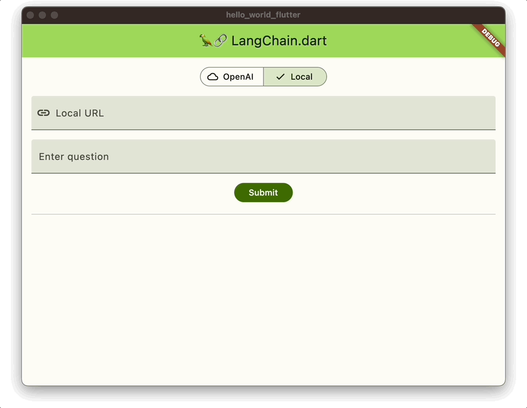

# Hello world Flutter

This sample app demonstrates how to call an LLM from a Flutter application using LangChain.dart.

You can find all the details in the [LangChain.dart 101: what can you build with it?](https://blog.langchaindart.com/langchain-dart-101-what-can-you-build-with-it-%EF%B8%8F-99a92ccaec5f)
blog post.

## Usage

```bash
flutter run
```

### Using OpenAI API

You can get your OpenAI API key [here](https://platform.openai.com/account/api-keys).



### Local model

You can easily run local models using [Prem app](https://www.premai.io/#PremApp). It creates a local
server that exposes a REST API with the same interface as the OpenAI API.


