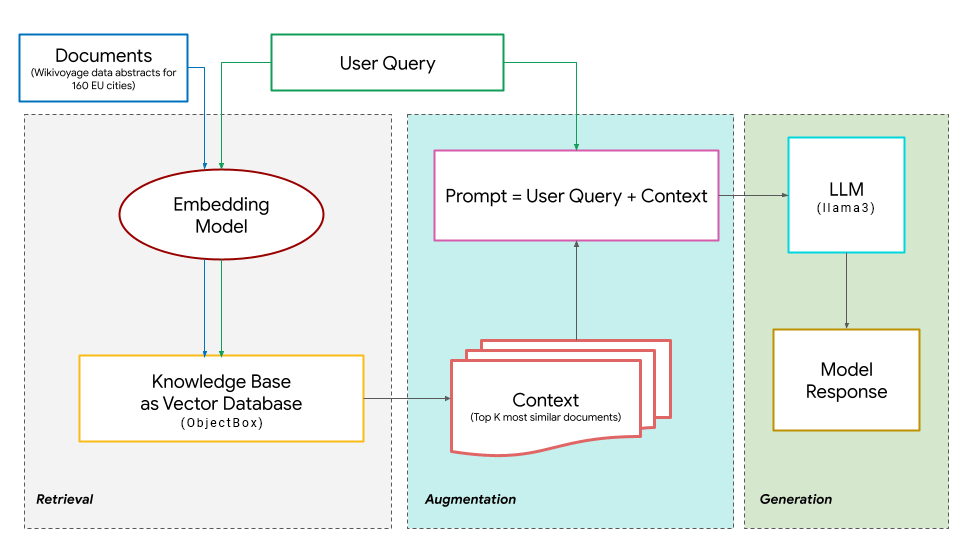
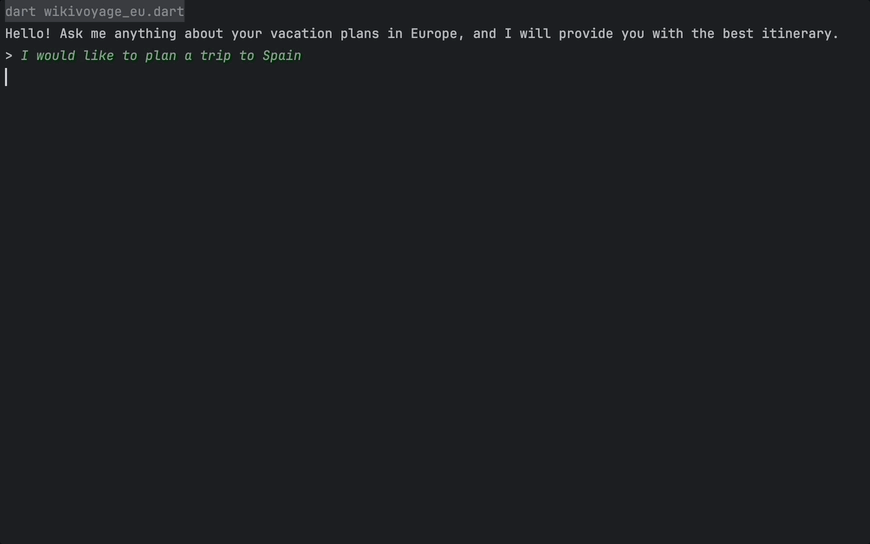

# Wikivoyage EU

This example demonstrates how to build a fully local Retrieval Augmented Generation (RAG) pipeline with Llama 3 and ObjectBox using LangChain.dart and Ollama.

> This example is adapted from [Ashmi Banerjee](https://ashmibanerjee.com)'s workshop "[Building a RAG using Google Gemma and MongoDB](https://colab.research.google.com/drive/1CviSVwnwl73ph-AhTB0Z8vYcOQrjityk)".


*Figure 1: RAG Architecture (source: [Ashmi Banerjee](https://colab.research.google.com/drive/1CviSVwnwl73ph-AhTB0Z8vYcOQrjityk))*

## Setup

### 1. Install Ollama 

- Go to the [Ollama](https://ollama.ai/) website and download the latest version of the Ollama app.

### 2. Download models

- For this example we will be using the following models:
  * Embedding model: [`jina/jina-embeddings-v2-small-en`](https://ollama.com/jina/jina-embeddings-v2-small-en)
  * LLM: [`llama3:8b`](https://ollama.com/library/llama3)
- Open your terminal and run:
```bash
ollama pull jina/jina-embeddings-v2-small-en
ollama run llama3:8b
``` 

### 3. Setup ObjectBox

- We will be using [ObjectBox](https://objectbox.io) for our vector store.
- In order to use ObjectBox, we need to download the ObjectBox C library. You can find more information on how to do this [here](https://docs.objectbox.io/getting-started).
```bash
bash <(curl -s https://raw.githubusercontent.com/objectbox/objectbox-dart/main/install.sh) 
```

### 4. Get dependencies

```bash
dart pub get
```

## How it works

The example has two scripts:
1. `injestion.dart`: This script reads the Wikivoyage dataset, creates embeddings from the data and stores it in the ObjectBox database.
2. `wikivoyage_eu.dart`: This script implements the chatbot implementing the RAG pipeline.

### Ingestion

We will be using data from [Wikivoyage](https://wikivoyage.org), a freely accessible online travel guide authored by volunteers.

The `wikivoyage_eu_dataset.csv` file contains data from 160 European cities, including the city name, country, coordinates, population and a brief description:

| city      | country     | lat     | lng    | population | abstract                                                                                                                                                                                                           |
|-----------|-------------|---------|--------|------------|--------------------------------------------------------------------------------------------------------------------------------------------------------------------------------------------------------------------|
| Amsterdam | Netherlands | 52.3728 | 4.8936 | 1459402.0  | Amsterdam is the capital of the Netherlands. It is known for the canals that cross the city, its impressive architecture, museums and art gallerie, its notorious red light district, and more than 1,500 bridges. |

The  script does the following:
1. It uses LangChain.dart's `CsvLoader` to load the `wikivoyage_eu_dataset.csv` dataset.
2. It uses the `jina/jina-embeddings-v2-small-en` model to create embeddings for each city's data. The generated embeddings have 1024 dimensions.
   + *As the data for each city is not very large, we won't be chunking it into smaller parts, but you could easily do that using the `RecursiveCharacterTextSplitter` class.*
3. It stores the embeddings in the ObjectBox vector database.

You can run the script using:
```bash
$ dart run bin/injestion.dart
Added 160 documents to the vector store.
```

### Chatbot

The chatbot script implements the RAG pipeline. It does the following:
1. Takes a user query as input.
2. Uses the `jina/jina-embeddings-v2-small-en` model to create an embedding for the query.
3. Retrieves the 5 most similar documents from the ObjectBox database.
4. Builds a prompt using the retrieved documents and the query.
5. Uses the `llama3:8b` model to generate a response to the prompt.

You can run the script using:
```bash
$ dart run bin/wikivoyage_eu.dart
```



## Conclusion

This example demonstrates how to build a simple RAG pipeline that can run locally on your machine. You can easily extend this example to build more complex RAG pipelines with more advance retrieval and generation techniques. Check out the [LangChain.dart](https://langchaindart.dev/) documentation for more information. 

For simplicity, this example is a CLI application. However, you can easily adapt this code to work in a Flutter app. To get started with ObjectBox in Flutter, refer to the [ObjectBox documentation](https://docs.objectbox.io/getting-started).
